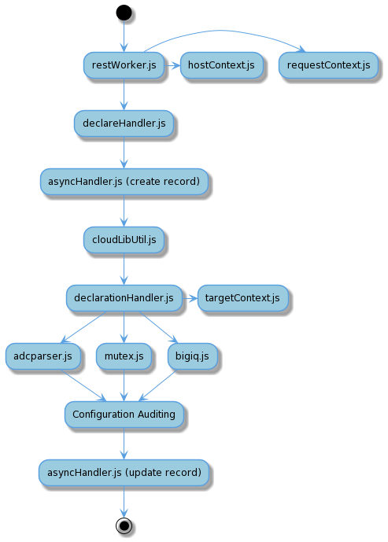
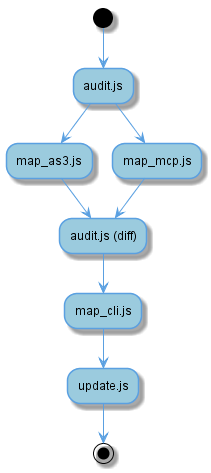

# AS3 Code Overview

## Request Handling

### restWorker.js
* Entry point for iControlLX Extension Framework
* Handles all supported HTTP endpoints and methods
* Stores HostContext information

### declareHandler.js
* Processes query parameters
* Handles differences between single and multiple declarations
* Handles AS3 request options

### declarationHandler.js
* Handles declaration history
* Generates declarations from PATCH requests

### adcParser.js
* Performs JSON Schema validation using AJV
* Loads custom keywords from adcParserKeywords.js
* Loads custom formats from adcParserFormats.js
* Asynchronous validation tasks are handled after AJV validation
  * AJV validation gathers async tasks through custom keywords

### mutex.js
* Prevents multiple AS3 operations from conflicting
* Acquired via POST request to data-group
  * A 200 response means the mutex was acquired
  * A 409 response means the mutex is unavailable
  * Other responses are treated as an error
* Released via DELETE request to data-group

### bigiq.js
* Deploys declarations to BIG-IQ specific endpoints

### asyncHandler.js
* Creates and tracks asynchronous request records
* Records are persisted to data groups

### cloudLibUtil.js
* Installs f5-service-discovery RPM
* Used to install cloud-libs before f5-service-discovery

## /Context

### context.js
* Central object sent through AS3
* Holds host, request, and target context objects
* We build the initial Context object in restWorker

#### hostContext.js
* Gathers and holds information on the host machine
* Set during AS3 startup

#### requestContext.js
* Holds information regarding the original request to AS3
* Created per request to AS3

#### targetContext.js
* Holds information of a sub-declaration's target machine
* Gathers BIG-IP information (e.g. version and provisioning)
* Set in declarationHandler

## Configuration Auditing

### audit.js
* Determines work to perform on the BIG-IP and applies it
* Gathers current configuration of the BIG-IP
* Diffs desired and current configuration

### map_as3.js
* Normalizes the incoming AS3 declaration
* Normalization uses normalize.js and properties.json

### map_mcp.js
* Normalizes the current BIG-IP configuration
* Normalization uses normalize.js and properties.json

### map_cli.js
* Converts diff of current and desired state into tmsh commands

### update.js
* Applies necessary tmsh commands using a tmsh cli script
* Where supported, tmsh commands are put into a tmsh transaction

## Notes on Container
* Most BIG-IP interactions are done with iControlREST, so there should not be much difference for containers
* Async records are only kept in memory instead of persisting to data groups
* To avoid problems with the container, it is important to have an X-F5-Auth-Token header on HTTP requests

## Notes on BIG-IQ
* AS3 requests are received on the BIG-IQ, processed, and forwarded to a BIG-IP
* BIG-IQ makes use of the schemaOverlay feature to allow users to define new restrictions and defaults
* Special endpoints are used for deploying and retreiving declarations
* The output of adcParser must be a valid AS3 declaration for BIG-IQ to work
