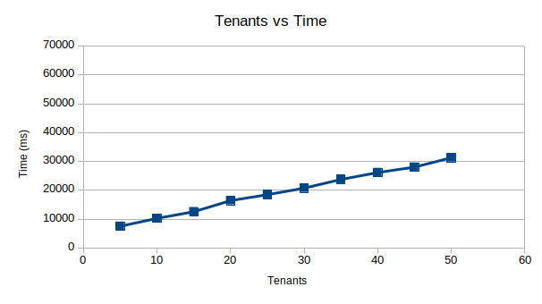
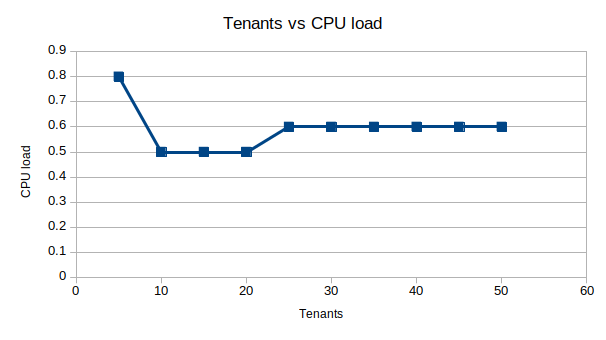
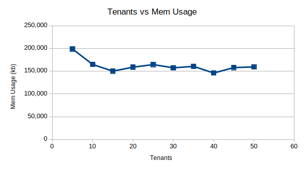
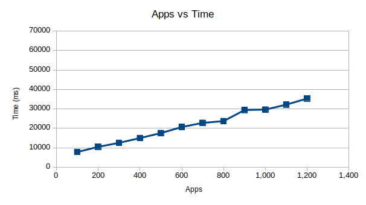
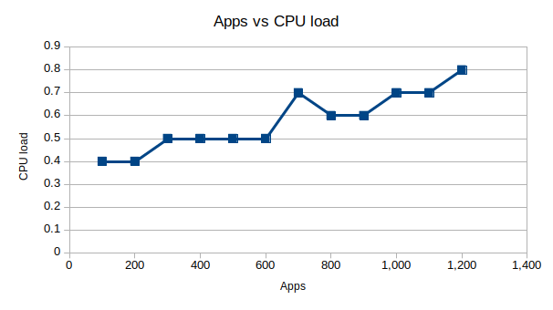
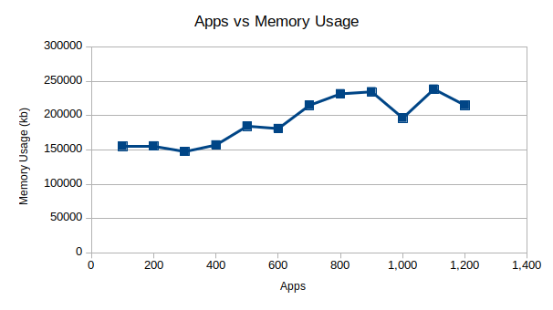

# Sizing Data

## Test Results
* These tests were ran by sending 2k chunks into the BIGIP at a time.
* Higher numbers of Tenants and Apps were not tested as they would fail due to the 1 minute timeout.
* If the script fails before completing, it will not output the data.

### Testing Results

NOTE: When the Y value drops to 0, it's because the test failed to grab the data, or more likely had an error.

## Setting up Memory/CPU gathering server

1. **scp scripts/dev/gather-cpu-mem-server.js**
to your BigIP /tmp directory: `scp scripts/dev/gather-cpu-mem-server.js root@<device_ip>:/tmp`
1. **SSH into the root user on the BigIP**
1. **Start the server by calling the js file**
`nodejs /tmp/gather-cpu-mem-server.js`

## How to Run the script
`AS3_HOST=<device_ip> AS3_USERNAME=admin AS3_PASSWORD=admin nodejs scripts/dev/get-sizing-data.js max_tenant max_app`

1. Set the AS3_HOST value to the IP address of the BIG IP
1. Set the AS3_USERNAME and AS3_PASSWORD, appropriately
1. max_tenant is an argument that sets the maximum number of tenants you want to test (set to 0 to not test).
1. max_app is an argument that sets the maximum number of apps you want to test (set to 0 to not test).

## How to use
1. **Go to the scripts folder**
2. **Run command**
See the Command Templates above for your desired tests. See the following explanation on Arguments for clarification.
3. **Open CSV file**
The script will output a formatted .csv file in whatever directory the script is called from.
4. **Create graph**
Using the .csv create any desired graphs. If you're using libreOffice select the columns you want (e.g. time and apps), open "insert -> chart...", select chart type of scatter plot, format and label as desired.

## How it works
NOTE: all apps have a single VirtualAddress which is incrementally generated.
1. The script starts by making **min_num_tenants** worth of tenants, each with only 1 app.
2. A DELETE is sent to the BigIP cleaning out any previous runs.
3. A POST with the tenants is sent to the BigIP.
4. Repeat steps 1-3: where **min_num_tenants** += **step_num_tenants**, while **min_num_tenants** <= **max_num_tenants**.
5. After completing all the tenant testing, the script will shift to creating 1 tenant wtih **min_num_apps** worth of apps.
6. A DELETE is sent to the BigIP cleaning out any previous runs.
7. A POST with the tenant and apps is sent to the BigIP.
8. Repeat steps 5-7: where **min_num_apps** += **step_num_apps**, while **min_num_apps** <= **max_num_apps**.

## Special Configurations (manually modified in the test file)

**min_num_tenants**: Sets the minimum number of tenants you want to test. (default 1)

**step_num_tenants**: Sets the number of tenants you want to skip after each step. (default/min 1)

**min_num_apps**: Sets the minimum number of apps you want to test. (default 1)

**step_num_apps**: Sets the number of apps you want to skip after each step. (default/min 1)

**repeat**: Indicates the number of times you want to rerun the entire test.

**oct_{0-3}**: Are the variables used to calculate the next IP. Note: Oct_0 and Oct_1 will remain static, meaning you'll only have 65,536 possible IPs.
Console.log prints are commented out throughout the test file. Feel free to uncomment them for debugging purposes, but comment them again before committing.

## Using get-cpu-mem-overtime.js
`AS3_HOST=<device_ip> AS3_USERNAME=admin AS3_PASSWORD=<admin_password> AWS_ACCESS_KEY_ID=<aws_access_key_id> AWS_SECRET_ACCESS_KEY=<aws_secret_access_key> nodejs scripts/dev/get-cpu-mem-overtime.js num_discovery_service_members`

1. Set the AS3_HOST value to the IP address of the Big-Ip
1. Set the AS3_USERNAME and AS3_PASSWORD, appropriately
1. Set the num_discovery_service_members equal to the number of members you want in the declaration.

**Note:** Variables in the script: minRunTimes - This is the number of times this script will contact the Big-IP to gather information. Each call should take at least 5 seconds.

See the above **How to use** section for information on workflow.

This script was developed directly from the get-sizing-data.js script so most of the functionality is the same.

**Note:** The CPU output is reliant on just the Average User value, and so will be different than what you will see on the Big-IP performance values.
